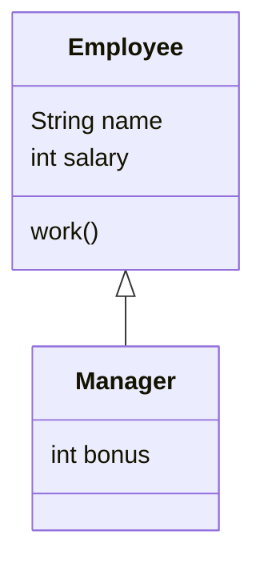

# EasyOrder
0911第一次作業

# 📘 Markdown 語法完整教學範例

> 適合：Markdown 初學者、課堂教學、GitHub、Typora、Obsidian、VS Code

---

# 1️⃣ 標題 Heading

Markdown 使用 `#` 建立標題。

## 語法

```markdown
# H1 標題
## H2 標題
### H3 標題
#### H4 標題
##### H5 標題
###### H6 標題
```

## 顯示效果

# H1 標題

## H2 標題

### H3 標題

#### H4 標題

##### H5 標題

###### H6 標題

---

# 2️⃣ 粗體、斜體、刪除線

## 粗體

```markdown
**粗體文字**
```

效果：

**粗體文字**

---

## 斜體

```markdown
*斜體文字*
```

效果：

*斜體文字*

---

## 粗斜體

```markdown
***粗斜體文字***
```

效果：

***粗斜體文字***

---

## 刪除線

```markdown
~~刪除文字~~
```

效果：

~~刪除文字~~

---

# 3️⃣ 段落與換行

一般文字直接輸入即可。

```markdown
這是第一段文字。

這是第二段文字。
```

效果：

這是第一段文字。

這是第二段文字。

---

## 強制換行

可在行尾加入兩個空白：

```markdown
第一行  
第二行
```

效果：

第一行  
第二行

---

# 4️⃣ 無序清單

可以使用：

```markdown
- 項目一
- 項目二
- 項目三
```

效果：

- 項目一
- 項目二
- 項目三

也可以使用：

```markdown
* Java
* Python
* JavaScript
```

效果：

* Java
* Python
* JavaScript

---

# 5️⃣ 巢狀清單

## 語法

```markdown
- Java
  - OOP
  - Collection
  - Stream
- Python
  - Pandas
  - Flask
```

## 效果

- Java
  - OOP
  - Collection
  - Stream
- Python
  - Pandas
  - Flask

---

# 6️⃣ 有序清單

## 語法

```markdown
1. 安裝 JDK
2. 安裝 Eclipse
3. 建立 Java Project
4. 撰寫程式
```

## 效果

1. 安裝 JDK
2. 安裝 Eclipse
3. 建立 Java Project
4. 撰寫程式

---

# 7️⃣ 引用 Blockquote

## 語法

```markdown
> 這是一段引用文字。
```

## 效果

> 這是一段引用文字。

---

## 多層引用

```markdown
> 第一層
>> 第二層
>>> 第三層
```

效果：

> 第一層
>> 第二層
>>> 第三層

---

# 8️⃣ 行內程式碼

## 語法

```markdown
使用 `System.out.println()` 輸出文字。
```

## 效果

使用 `System.out.println()` 輸出文字。

---

# 9️⃣ 程式碼區塊

使用三個反引號：

````markdown
```java
public class Test {

    public static void main(String[] args) {

        System.out.println("Hello Java");
    }
}
```
````

## 顯示效果

```java
public class Test {

    public static void main(String[] args) {

        System.out.println("Hello Java");
    }
}
```

---

# 🔟 指定程式語言

Markdown 可以指定語言，讓程式碼有語法上色。

## Java

````markdown
```java
int x = 10;
System.out.println(x);
```
````

## Python

````markdown
```python
x = 10
print(x)
```
````

## JavaScript

````markdown
```javascript
let x = 10;
console.log(x);
```
````

## HTML

````markdown
```html
<h1>Hello</h1>
```
````

---

# 1️⃣1️⃣ 超連結

## 語法

```markdown
[Google](https://www.google.com)
```

## 效果

[Google](https://www.google.com)

---

# 1️⃣2️⃣ 圖片

## 語法

```markdown

```

範例：

```markdown

```

---

# 1️⃣3️⃣ 分隔線

## 語法

```markdown
---
```

或：

```markdown
***
```

效果：

---

---

# 1️⃣4️⃣ 表格 Table

## 語法

```markdown
| 姓名 | 課程 | 成績 |
|---|---|---:|
| Allen | Java | 90 |
| David | Python | 85 |
| Mary | AI | 95 |
```

## 效果

| 姓名 | 課程 | 成績 |
|---|---|---:|
| Allen | Java | 90 |
| David | Python | 85 |
| Mary | AI | 95 |

---

# 1️⃣5️⃣ 表格對齊

## 語法

```markdown
| 左對齊 | 置中 | 右對齊 |
|:---|:---:|---:|
| Java | Spring | 100 |
| Python | Pandas | 90 |
```

## 效果

| 左對齊 | 置中 | 右對齊 |
|:---|:---:|---:|
| Java | Spring | 100 |
| Python | Pandas | 90 |

---

# 1️⃣6️⃣ Checkbox 待辦清單

## 語法

```markdown
- [x] 安裝 JDK
- [x] 安裝 Eclipse
- [ ] 建立 Java Project
- [ ] 完成作業
```

## 效果

- [x] 安裝 JDK
- [x] 安裝 Eclipse
- [ ] 建立 Java Project
- [ ] 完成作業

---

# 1️⃣7️⃣ Emoji 圖示

Markdown 可直接加入 Emoji：

```markdown
📘 教學
💡 重點
⚠️ 注意
✅ 完成
❌ 錯誤
🚀 開始
🧪 測試
💻 程式
```

效果：

📘 教學  
💡 重點  
⚠️ 注意  
✅ 完成  
❌ 錯誤  
🚀 開始  
🧪 測試  
💻 程式

---

# 1️⃣8️⃣ 特殊符號跳脫 Escape

如果想顯示 Markdown 特殊符號本身，可以使用反斜線 `\`。

## 語法

```markdown
\*這不是斜體\*
\# 這不是標題
```

## 效果

\*這不是斜體\*

\# 這不是標題

---

# 1️⃣9️⃣ HTML 混用

Markdown 通常可以直接加入 HTML。

## 語法

```html
<p style="color:red;">紅色文字</p>
```

注意：

> 不同 Markdown 編輯器對 HTML 支援程度不同。

---

# 2️⃣0️⃣ Mermaid 流程圖

部分 Markdown 工具支援 Mermaid。

例如 GitHub、Typora、Obsidian、部分文件系統。

## 語法

````markdown

````

## 流程圖


---

# 2️⃣1️⃣ Mermaid 類別圖

## 語法

````markdown

````

## 顯示


---

# 2️⃣2️⃣ 教學重點框

可以利用引用製作重點：

```markdown
> 💡 **重點**
>
> Markdown 是一種輕量級標記語言。
```

效果：

> 💡 **重點**
>
> Markdown 是一種輕量級標記語言。

---

# 2️⃣3️⃣ 注意事項框

```markdown
> ⚠️ **注意**
>
> 不同 Markdown 編輯器支援的功能可能不同。
```

效果：

> ⚠️ **注意**
>
> 不同 Markdown 編輯器支援的功能可能不同。

---

# 2️⃣4️⃣ 完整教學文件範例

下面是一個完整 Markdown 教材格式。

````markdown
# 🚀 Java 課程

## 📘 Chapter 1：Java 基礎

### 🎯 學習目標

- primitive type
- operator
- if
- loop

---

## 💻 範例程式

```java
public class Test {

    public static void main(String[] args) {

        int score = 85;

        if(score >= 60) {
            System.out.println("Pass");
        }
    }
}
```

---

## 📊 成績表

| 姓名 | 成績 | 結果 |
|---|---:|---|
| Allen | 85 | Pass |
| David | 55 | Fail |

---

## ✅ 作業

- [ ] 完成 if 練習
- [ ] 完成 loop 練習
- [ ] 上傳 GitHub
````

---

# 📚 Markdown 常用語法速查表

| 功能 | Markdown |
|---|---|
| H1 標題 | `# 標題` |
| H2 標題 | `## 標題` |
| 粗體 | `**文字**` |
| 斜體 | `*文字*` |
| 刪除線 | `~~文字~~` |
| 行內 Code | `` `code` `` |
| 無序清單 | `- 項目` |
| 有序清單 | `1. 項目` |
| 引用 | `> 文字` |
| 連結 | `[文字](網址)` |
| 圖片 | `` |
| 表格 | `| A | B |` |
| Checkbox | `- [ ] 工作` |
| 分隔線 | `---` |
| 程式區塊 | 三個反引號 |
| Mermaid | ` ```mermaid ` |

---

# 🎯 建議教學順序

```text
標題
 ↓
文字格式
 ↓
清單
 ↓
引用
 ↓
超連結
 ↓
圖片
 ↓
程式碼
 ↓
表格
 ↓
Checkbox
 ↓
Emoji
 ↓
Mermaid
 ↓
完整文件實作
```

---

# 🧪 課堂練習

請學生使用 Markdown 製作：

## 題目：我的 Java 學習筆記

必須包含：

1. 一個 H1 標題
2. 二個 H2 標題
3. 粗體文字
4. 斜體文字
5. 一個超連結
6. 一張圖片
7. 一個 Java 程式碼區塊
8. 一個表格
9. Checkbox
10. 一個 Mermaid 流程圖

---

# ✅ 完成範例

```markdown
# 🚀 我的 Java 學習筆記

## 📘 今天學習內容

- primitive type
- operator
- if

## 💻 Java 範例

```java
int score = 90;

if(score >= 60) {
    System.out.println("Pass");
}
```

## ✅ 學習進度

- [x] primitive type
- [x] operator
- [ ] loop
```

---

> 🎓 **學習完成**
>
> 掌握 Markdown 後，可以用來製作：
>
> - 技術教材
> - README
> - GitHub 文件
> - AI Prompt 文件
> - API 文件
> - 專案說明
> - 課程講義


