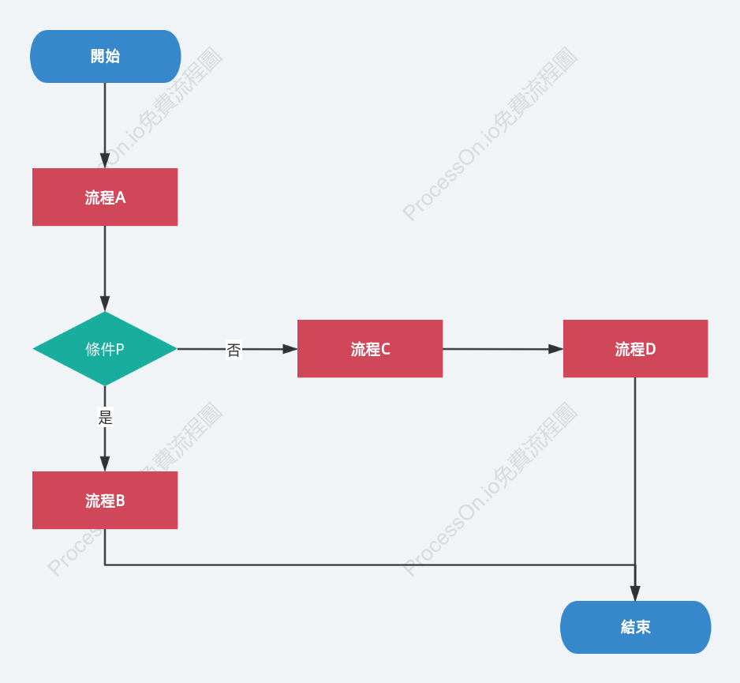

# EasyOrder02 專案內容簡介
[簡介說明](doc/EasyOrder02_Discussion_Summary.md)<br>
<br>

## 一、專案名稱

**EasyOrder02**

本專案是一個以 **Java Swing** 製作的簡易點餐／訂單管理程式，主要練習 Java 基礎語法、物件導向程式設計，以及 Swing 圖形使用者介面（GUI）的實作。

---

## 二、專案主要功能

### 1. 餐點選擇

畫面提供不同餐點的選擇，使用者可以針對餐點進行數量增加或減少。

### 2. 「＋」增加數量

按下餐點旁的 **＋按鈕**：

- 該餐點數量增加 1。
- 依照目前數量更新畫面。
- 當數量由 0 增加到 1 時，可在下方訂單區產生對應的資料列。

### 3. 「－」減少數量

按下餐點旁的 **－按鈕**：

- 該餐點數量減少 1。
- 數量不應低於 0。
- 當數量減少為 0 時，可移除或更新下方對應的訂單資料列。

### 4. 動態產生訂單資料列

依照餐點數量，在畫面下方動態建立訂單資料。

每一列可包含：

- 餐點名稱
- 餐點單價
- 餐點數量
- 小計

例如：

```text
餐點名稱        單價        數量        小計
------------------------------------------------
美式咖啡        50          2           100
拿鐵            60          1            60
```

### 5. 數量與金額即時更新

當使用者按下「＋」或「－」時，程式可以重新計算：

**小計 = 單價 × 數量**

並依照目前訂單內容更新畫面。

---

## 三、主要 Java 學習內容

本專案可以用來練習以下 Java 技術：

### 1. 類別（Class）

將餐點或訂單資料設計成 Java 類別，例如：

```java
class MenuItem {
    String name;
    int price;
    int quantity;
}
```

---

### 2. 建構子（Constructor）

建立物件時，利用建構子設定餐點的初始資料。

```java
MenuItem(String name, int price) {
    this.name = name;
    this.price = price;
}
```

---

### 3. 方法（Method）

將「增加數量」、「減少數量」、「計算小計」等功能寫成方法。

```java
void addQuantity() {
    quantity++;
}
```

---

### 4. 一維陣列（Array）

可以使用陣列保存多個餐點資料，例如：

```java
String[] menuName = {
    "美式咖啡",
    "拿鐵",
    "紅茶"
};

int[] menuPrice = {
    50,
    60,
    40
};
```

這種寫法適合初學者理解「多筆資料如何集中管理」。

---

### 5. for 迴圈

利用 `for` 迴圈逐一處理餐點資料。

```java
for (int i = 0; i < menuName.length; i++) {
    System.out.println(menuName[i]);
}
```

---

### 6. if 判斷

依照數量判斷是否新增、更新或移除訂單資料。

```java
if (quantity > 0) {
    // 顯示訂單資料
} else {
    // 移除訂單資料
}
```

---

### 7. Swing GUI

使用 Java Swing 建立圖形介面，例如：

- `JFrame`
- `JPanel`
- `JLabel`
- `JButton`
- `JTextField`
- `JScrollPane`

---

### 8. 事件處理（ActionListener）

按下「＋」或「－」按鈕後，透過事件處理程式執行相對應的功能。

```java
button.addActionListener(e -> {
    // 按鈕被按下後執行的程式
});
```

---

## 四、程式執行流程

整體程式的基本流程如下：

```text
啟動程式
   ↓
建立點餐畫面
   ↓
顯示餐點與數量控制按鈕
   ↓
使用者按「＋」
   ↓
餐點數量 +1
   ↓
更新下方訂單資料
   ↓
重新計算小計與總金額
   ↓
使用者按「－」
   ↓
餐點數量 -1
   ↓
更新或移除下方訂單資料
   ↓
重新計算金額
```

---

## 五、專案適合的學習階段

EasyOrder02 適合用來整合以下 Java 基礎內容：

1. 變數
2. 資料型別
3. `if / else`
4. `for` 迴圈
5. 一維陣列
6. 類別與物件
7. Constructor
8. Method
9. 物件與陣列的搭配
10. Java Swing
11. 按鈕事件
12. 動態建立 GUI 元件

---

## 六、後續可以增加的功能

未來可以在此專案上繼續加入：

- 清空訂單
- 計算總金額
- 顯示訂單總數
- 顯示付款金額
- 計算找零
- 刪除單一餐點
- 修改餐點價格
- 新增餐點
- 儲存訂單
- 讀取歷史訂單
- 使用檔案保存資料
- 使用資料庫保存訂單
- 將程式拆成多個 Java Class

---

## 七、學習目標

完成本專案後，可以理解如何把 Java 的：

**「變數 → 陣列 → 物件 → 方法 → 條件判斷 → 迴圈 → Swing → 事件處理」**

整合成一個實際可以操作的點餐程式。

這也是從 Java 基礎語法進一步學習 **Java OOP + GUI 實作** 的練習範例。

---

## 八、開發工具建議

建議使用：

- **Eclipse**
- **Java JDK**
- **WindowBuilder**
- Java Swing

如果使用 Eclipse + WindowBuilder，可以透過視覺化介面配置 `JFrame`、`JPanel`、`JButton`、`JLabel` 等元件，再搭配 Java 程式碼完成動態點餐功能。

---

## 九、專案重點

本專案最重要的練習重點是：

> **使用者按下「＋／－」按鈕後，程式能根據數量動態更新下方的訂單資料。**

因此，學習時可以特別注意：

**按鈕事件 → 修改數量 → 判斷數量 → 動態建立／移除元件 → 更新畫面 → 計算金額**

這一連串流程。
